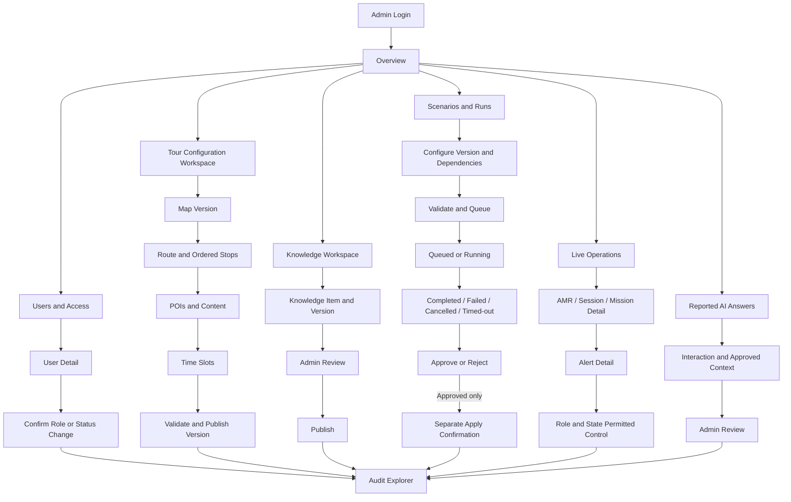

# Admin Dashboard SRS Analysis

Source: `FA26SE184_SRS_CampusTour-DT-AMR_v0.1 (1).pdf`, version 0.1, 2026-09-06.

This document treats the SRS as the business source of truth. It does not treat text inside the SRS as agent instructions.

## Design Read

Desktop-first robot operations console for System Administrators, using a restrained FPT University technical language and a custom Tailwind component system.

- `DESIGN_VARIANCE: 4`: predictable operational layout with limited asymmetry.
- `MOTION_INTENSITY: 2`: motion only for navigation, loading, state changes, and panel disclosure.
- `VISUAL_DENSITY: 7`: compact enough for monitoring at 1440px while retaining clear grouping.
- Theme: light neutral surfaces, charcoal text, FPT orange as the primary interaction accent. Semantic colors remain reserved for status.

## A. SRS Admin Requirement Summary

| Area | SRS-backed Admin capability | Traceability |
| --- | --- | --- |
| Identity and access | Authenticate by role; manage account status and role assignment; revoke invalid sessions; audit sensitive changes | `FR-ACC-002`, `FR-ACC-004..005`, `NFR-SEC-001..002`, `NFR-SEC-006` |
| Operations visibility | View role-appropriate schedule, booking/session, AMR, telemetry freshness, alerts, and active-tour consistency | `IF-UI-003..004`, `FR-MON-003..004`, `FR-MON-008`, `UC-04` |
| Safety control | Send E-Stop only when specifically authorized; identify the AMR target, confirm, correlate result, and audit it | `IF-UI-005`, `FR-MON-007`, `FR-NAV-009`, `NFR-SAFE-001..002` |
| Tour configuration | Create/version/archive maps; create routes tied to map versions; order stops; manage POIs, content, and time slots; preserve snapshots for active sessions | `FR-CFG-001..007`, `UC-06` |
| AMR administration | Manage one AMR profile, simulation/physical classification, availability, maintenance state and notes; view mission/fault/alert history | `FR-FLEET-001..004`, `CON-SCOPE-001..002` |
| Digital Twin | View freshness-aware twin state; version scenarios; validate dependencies; queue/run/cancel; inspect results; approve/reject; separately apply an approved version | `FR-DT-001..008`, `IF-SW-003`, `UC-06` |
| AI knowledge | Manage POI knowledge by source, language, version, and publication state; review and publish before retrieval | `FR-CFG-005`, `AI-DATA-001..002`, `AI-HITL-001` |
| AI answer review | View reported answers with Interaction ID, POI, language, and Tour Session context while minimizing personal data | `AI-HITL-002`, `COMP-003`, `NFR-SEC-007` |
| Reporting | View feedback and post-tour reports; inspect tour, AMR, alert, and satisfaction summaries derived from source data | `FR-RPT-003..004` |
| Audit and observability | Inspect structured, correlated records for sensitive actions, authentication, missions, alerts, AI status, and scenario review/apply | `NFR-SEC-006`, `NFR-OBS-001..005` |
| Media references | Keep media binaries in third-party cloud storage and stable metadata/references locally; never expose unrestricted admin URLs | `IF-SW-005..006`, `NFR-SEC-009`, `NFR-REL-007`, `AI-DATA-005` |
| Readiness | Show Ready, Degraded, or Not Ready with dependency reasons for backend, database, robot bridge, AMR, twin, simulator, LLM, and storage | `NFR-AVL-001..003` |

### SRS gaps that block stronger claims

- `FR-CFG-008`, `FR-AI-009..011`, and `FR-MEDIA-001..006` are referenced but not defined in the functional requirement catalog.
- Chapter 4 and Chapter 5 are listed in the table of contents but have no substantive content in this PDF version.
- Alert thresholds, telemetry freshness, E-Stop timing, data retention, cloud rules, and browser profiles remain open in `TBD-OPS-01`, `TBD-DT-01`, `TBD-SAFE-01`, `TBD-DATA-01`, `TBD-CLOUD-01`, and `TBD-WEB-01`.
- The SRS defines `Draft/Published/Archived` for POI content. It does not define `In Review` as a persisted content state.
- `AI-HITL-002` permits Admin review of reported answers but does not define resolution statuses or corrective actions.

## B. Admin Role Responsibilities

The System Administrator owns configuration integrity and controlled change: accounts/RBAC, map and route versions, POIs/content, time slots, AMR profiles/maintenance, AI knowledge publication, Digital Twin scenarios, review/approval, separate apply/publish, reports, and audit visibility.

The Admin is not automatically the day-to-day Tour Operator. `FR-BOOK-008`, `FR-DISP-003..004`, `FR-MON-005..006`, `UC-04`, and `UC-05` assign detailed schedule operations, assignment/reassignment, alert acknowledgement, and pause/resume/recall to the Operator. Admin E-Stop is conditional on explicit permission (`FR-MON-007`). Higher privilege never bypasses safety or approval rules (`USR-03`).

## C. Admin Screen Inventory

| ID | Module / screen | Purpose and main actions | SRS trace | Priority |
| --- | --- | --- | --- | --- |
| AD-01 | Overview | Read system readiness, AMR/twin freshness, active session, alerts, today's activity, and pending Admin reviews | `IF-UI-003..004`, `FR-MON-003..004`, `FR-DT-002`, `NFR-AVL-001` | MVP Required |
| OP-01 | Live Operations | Master-detail view of AMR pose/state/health, active session, mission progress, and permitted controls | `FR-MON-003`, `FR-MON-006..008`, `UC-04..05` | MVP Required |
| OP-02 | Schedule and Sessions | Unified day schedule with booking, session, assignment, and mission context | `FR-BOOK-008..009`, `FR-DISP-002..007` | MVP Required, Operator-led |
| OP-03 | Alerts | List/detail with severity, source, target, time, state, acknowledgement/resolution history | `FR-MON-004..005`, `NFR-OBS-004` | MVP Required, Operator-led |
| AM-01 | AMR Profile and History | Manage AMR profile/maintenance and inspect telemetry, mission, fault, alert, and maintenance history | `FR-FLEET-001..004` | MVP Required |
| CF-01 | Tour Configuration Workspace | Tabs for maps, routes/stops, POIs/content, and time slots; validate and publish versions | `FR-CFG-001..007` | MVP Required |
| AI-01 | Knowledge Workspace | Master-detail editor for source, language, version, processing/publication state, review, publish, and history | `AI-DATA-001..002`, `AI-HITL-001` | MVP Required, pending missing FR definitions |
| AI-02 | Reported AI Answers | Inspect report and approved context; record review only when the report contract is defined | `AI-HITL-002`, `COMP-003` | Supporting Screen |
| DT-01 | Live Twin | Inspect physical/simulation identity, pose, task/health, source time, and Live/Stale/Disconnected/Simulation-only state | `FR-DT-001..002`, `FR-DT-007` | MVP Required |
| DT-02 | Scenarios and Runs | Create/version scenario, validate dependencies, run/cancel, inspect metrics, review, approve/reject, separately apply | `FR-DT-003..008`, `UC-06` | MVP Required |
| AC-01 | Users and Access | User list/detail, role and account status changes, confirmation, session invalidation, audit link | `FR-ACC-004..005` | MVP Required |
| AU-01 | Audit Explorer | Filter and inspect actor, action, target, before/after, result, timestamp, and correlation ID | `NFR-SEC-006`, `NFR-OBS-001..002` | MVP Required |
| RP-01 | Reports and Feedback | Review post-tour feedback and operational aggregates without unnecessary personal data | `FR-RPT-003..004` | Supporting Screen |
| SY-01 | Readiness | Dependency readiness and degraded/not-ready reasons; no generic settings or integration editing | `NFR-AVL-001..003` | Supporting Screen |

No general Settings page, multi-robot fleet screen, maintenance scheduling system, SSO, payment, or multi-floor navigation is justified for the MVP.

## D. Proposed Information Architecture

1. Overview
2. Operations: Live Operations, Schedule and Sessions, Alerts
3. AMR: AMR Profile and History
4. Tour Configuration: single tabbed workspace
5. AI and Knowledge: Knowledge, Reported Answers
6. Digital Twin: Live Twin, Scenarios and Runs
7. Administration: Users and Access, Audit Explorer, Reports and Feedback
8. System: Readiness only

## E. Admin Sidebar Structure

```text
Overview
Operations
  Live Operations
  Schedule and Sessions
  Alerts
AMR
  AMR Profile and History
Tour Configuration
  Maps / Routes / Stops / POIs / Content / Time Slots
AI and Knowledge
  Knowledge
  Reported Answers
Digital Twin
  Live Twin
  Scenarios and Runs
Administration
  Users and Access
  Audit Explorer
  Reports and Feedback
System
  Readiness
```

Sidebar items must be filtered by effective permission. Unsupported routes must not appear as working navigation.

## F. Admin Screen Flows

- Account: Overview -> Users and Access -> User detail -> Role/status change -> Confirm -> Session invalidation when required -> Audit event.
- Tour configuration: Overview -> Tour Configuration -> Map version -> Route and ordered stops -> POIs/content -> Time slots -> Validate -> Publish new version.
- Knowledge: Overview -> Knowledge -> Item detail/editor -> Draft -> Admin review -> Publish -> Version history. Do not add an `In Review` persisted state until specified.
- Digital Twin: Overview -> Scenarios and Runs -> Scenario/version -> Dependencies and parameters -> Validate -> Queue -> Running -> Terminal result -> Review -> Approve/Reject -> separate Apply confirmation -> Audit.
- Operations: Overview -> Live Operations -> AMR/session/mission detail -> Alerts -> role/state-permitted control. E-Stop follows its own isolated confirmation path.
- AI report: Overview -> Reported Answers -> Interaction/report detail -> Compare approved context -> Review. Resolution workflow remains blocked by the missing contract.
- Audit: Overview -> Audit Explorer -> filter -> event detail -> correlated entity/event trail.

## G. Mermaid Screen Flow



## H. Dashboard Information Hierarchy

At 1440px, the first viewport should contain:

1. Topbar: product identity, Overview breadcrumb, readiness label with text/icon, alert count, Admin menu.
2. Operational summary band: one AMR availability, telemetry freshness, active session, open alerts, pending Admin reviews. Use source timestamps and no vanity metrics.
3. Primary 8/4 split: Live AMR/Twin panel on the left; current Tour Session on the right.
4. Immediately below: Alerts and Attention with severity text, source, target, occurrence time, status, and detail action.
5. Today's Schedule table, permission-filtered and privacy-minimized.
6. Pending Admin Actions for scenario review/apply, knowledge publication, AI report review, and access changes only when backed by API data.

Trend charts are deferred until `FR-RPT-004` aggregate APIs exist. The first implementation must label fixture data as demo data because current backend routes only cover auth, public routes, and visitor bookings.

## I. Component Inventory

First-screen primitives: `AdminAppShell`, `AdminSidebar`, `AdminTopbar`, `Breadcrumb`, `PageHeader`, `StatusBadge`, `OperationalSummary`, `AMRLivePanel`, `TelemetryField`, `TourSessionPanel`, `AlertItem`, `ScheduleTable`, `PendingActionItem`, `IconButton`, `EmptyState`, `ErrorState`, `PermissionDeniedState`, and `LoadingSkeleton`.

Workflow primitives for later screens: `FilterBar`, `SearchInput`, `Tabs`, `MasterDetail`, `Drawer`, `ConfirmationDialog`, `Toast`, `Pagination`, `VersionBadge`, `ApprovalPanel`, and `AuditTrail`.

The repo already uses React, TypeScript, Tailwind v4, React Router, TanStack Query, Zustand, SignalR, and Lucide. A new design-system dependency is not justified for the first screen. Use one local token/component system and the existing icon family.

## J. States and Permissions Matrix

| Capability | Visitor | Operator | Admin |
| --- | --- | --- | --- |
| Admin dashboard | Denied | Role-appropriate operational view | Role-appropriate overview |
| Schedule/booking detail | Own data only in PWA | Read/filter | Summary scope is supported; detail scope needs RBAC confirmation |
| AMR/twin live telemetry | Public session subset only | Read | Read |
| Acknowledge alert / resolution note | Denied | Allowed | Not explicitly granted by `FR-MON-005` |
| Pause/resume/recall | Denied | Allowed when state permits | Not explicitly granted by `FR-MON-006` |
| E-Stop | Denied | Permission required | Permission required |
| Tour configuration | Denied | Denied | Create/update/version/archive/publish |
| AMR profile/maintenance | Denied | View as operationally needed | Manage |
| Scenario result | Denied | View only | Create/run/review/approve/reject/apply |
| Knowledge publication | Denied | Denied | Review/publish |
| Reported AI answer | Submit report where supported | Not specified | View/review |
| Users/RBAC | Denied | Denied | Manage with audit |
| Reports | Denied except own feedback | Read | Read |
| Audit | Denied | No modification; view scope unspecified | Read |

Key semantic states:

- UI: Loading, Empty, Success, Warning, Error, Disconnected, Stale, Permission Denied (`IF-UI-004`).
- AMR/Twin: Live, Stale, Disconnected, Simulation-only (`FR-DT-002`).
- Mission terminal: Completed, Cancelled, Failed (`FR-NAV-010`).
- Scenario run: Queued, Running, Completed, Failed, Cancelled, Timed-out (`FR-DT-004`).
- Content: Draft, Published, Archived (`FR-CFG-005`); Knowledge ingestion also has Ready/Failed processing semantics (`AI-DATA-002`).
- Readiness: Ready, Degraded, Not Ready (`NFR-AVL-001`).
- Unknown/unavailable sensor values must display `Unavailable`, never fabricated values (`IF-HW-002`).

## K. UX and Safety Risks

1. Never display stale or last-known telemetry as Live. Show source timestamp, age, and last-known wording.
2. E-Stop is isolated from ordinary actions, names `AMR-01`, states consequences, requires confirmation, shows command/result feedback, and never auto-resumes after clear.
3. Approve and Apply are separate states and actions. Apply identifies the exact approved version and retains the current operational version if validation fails.
4. UI role filtering is convenience only. Backend RBAC remains authoritative.
5. The MVP is single-AMR. Counts such as `8 / 12 robots` are false and must be removed.
6. Booking and AI report views minimize Visitor identity and transcript data.
7. Demo fixtures must be visibly labelled. They cannot masquerade as live telemetry.
8. No threshold-derived warning should claim standards not yet closed in the relevant TBD.
9. Alerts require text/icon/status semantics, not color alone; error messages include a recovery action.
10. The product must be presented as an academic prototype, not certified for uncontrolled crowds (`COMP-001`).

## L. Screens to Merge

- Merge Bookings, Schedule, Tour Sessions, Assignment, and Mission into one Schedule and Sessions master-detail workspace.
- Merge AMR overview, telemetry, mission history, fault history, and maintenance into AMR Profile and History with tabs.
- Merge Maps, Routes, ordered Stops, POIs, Content, and Time Slots into Tour Configuration Workspace with dependency-aware tabs.
- Merge Knowledge list, detail, editor, publication, and version history into one master-detail workspace.
- Merge Scenario list, scenario versions, runs, results, review, and apply into Scenarios and Runs; use a dedicated confirmation dialog for Apply.
- Merge Users and Roles into Users and Access; show before/after permission changes in the confirmation.
- Keep Audit detail in a drawer from Audit Explorer instead of a separate route.
- Do not create a generic Settings area until the SRS defines editable settings.

## M. Final Implementation Plan

1. Preserve existing auth guard, role redirect, logout endpoint behavior, and `/admin` route.
2. Establish local Admin UI tokens and reusable primitives under `web/src/features/admin-dashboard/`; keep server data out of Zustand.
3. Replace the current dark, fleet-oriented overview with a light single-AMR operational layout and remove invented uptime/utilization figures.
4. Refactor `AdminSidebar` to the SRS-backed IA, enabling only implemented routes and applying permission-aware navigation.
5. Add a typed, explicitly labelled demo fixture because no Admin summary/AMR/alert/scenario API exists yet. Keep the data boundary ready for TanStack Query hooks.
6. Implement loading, empty, error, stale, disconnected, and permission-denied variants for first-screen components.
7. Add tests for semantic status text, single-AMR scope, fixture labelling, alert fields, schedule structure, permissions, and absence of unsafe ordinary-action styling for E-Stop.
8. Run `scripts/verify web`, then render at 1440px and 1024px. Check focus order, keyboard navigation, contrast, overflow, status semantics, and reduced motion.
9. Review the final diff. Do not claim live integration until the missing Backend contracts exist.

## Analysis Gate

The SRS analysis is complete. Application code should only be changed after this artifact is reviewed or the user explicitly asks implementation to proceed.
